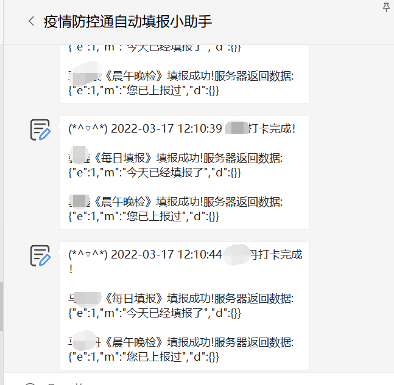
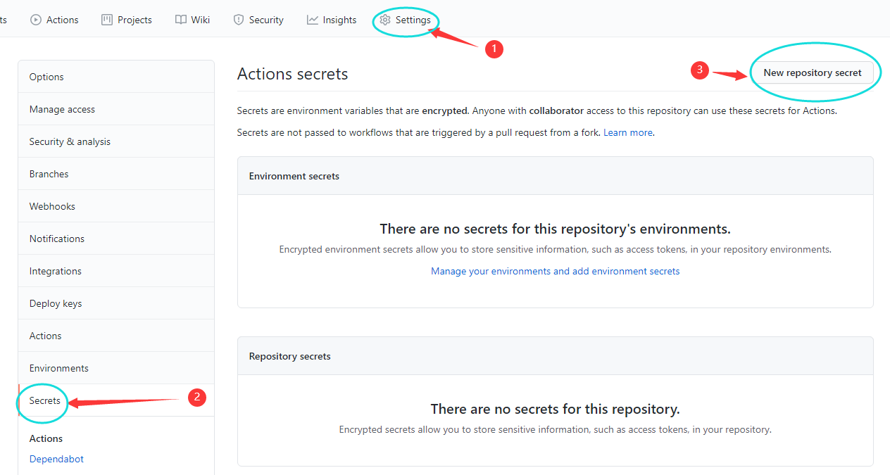
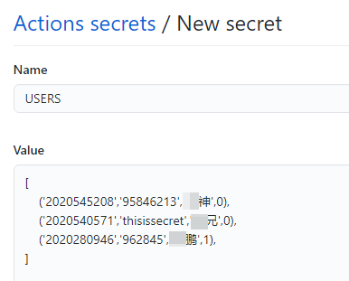
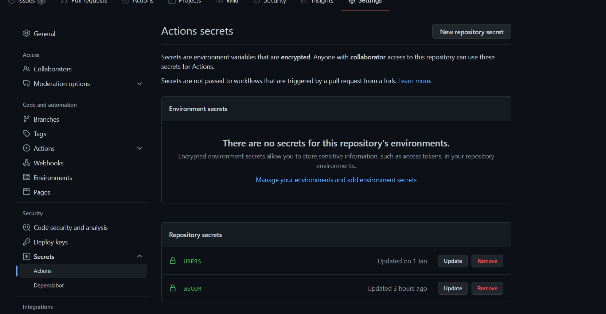
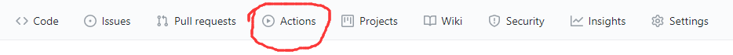
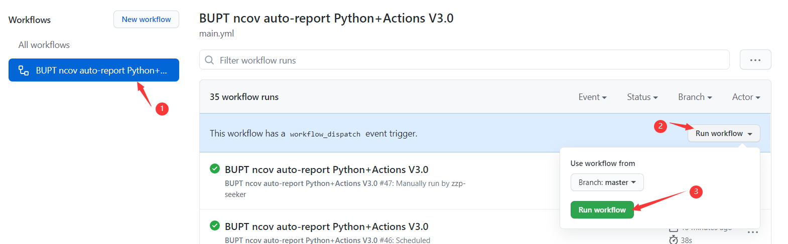
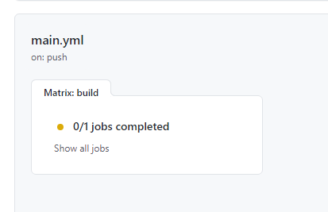
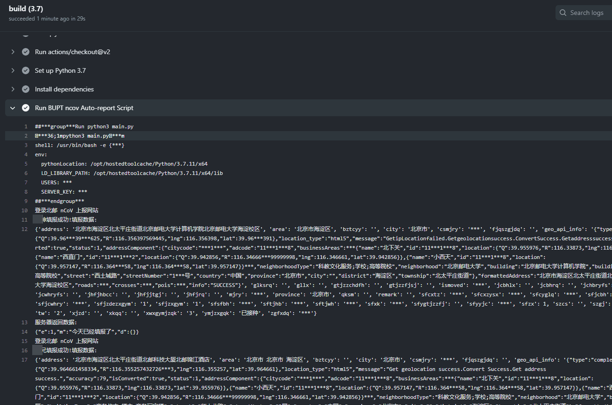

<h2 align="center">:helicopter:北邮疫情自动填报（Python+Github Actions）长期维护</h2>
<p align="center">
    <a href="https://github.com/zzp-seeker/bupt-ncov-auto-report/actions/workflows/main.yml">
        
    </a>
    
</p>


## 特点：

- cron设置自动多次填报（可通过main.yml修改）
- 支持晨午晚检
- 运行失败会自动往邮箱（注册github所用邮箱）发送邮件
- 可以多人同时填报（可以帮小伙伴一起打卡哦）
- 填报情况可以使用上一次打卡数据（如需更换请于当日脚本运行前手动打卡），也可以使用固定数据（填报地点始终位于北邮西土城校区）
- **（可选）** 填报结果自动推送至微信
  ​

<div align="center">

</div>


## 使用详解

1. 点击右上角的 **Use this template** 然后给仓库随便起一个名字，点击 **Create repository from template**
2. 点击 **Settings** ，进入 **Secrets** 页面，点击右上角的 **New repository secret**，流程如下图所示
<div align="center">

</div>

3. 一共有**两**个secret，第一个Name填**USERS**，Value按照如下格式填写：

```python
[
    (学号:str,密码:str,用户名:str,0 or 1),
    (学号:str,密码:str,用户名:str,0 or 1),
    (学号:str,密码:str,用户名:str,0 or 1),
    ... 如果还有则继续往后面加
]
```

相当于**列表**里面有很多**元组**，每个元组代表一个用户，可以有任意多个。每个元组有**四个元素**，前两个分别为**学号**和**密码**，字符串格式（可自行通过 [https://app.bupt.edu.cn/ncov/wap/default/index](https://app.bupt.edu.cn/ncov/wap/default/index) 登陆验证账号密码正确性，密码一般为身份证后8位），第三个为**用户名**（随便填，用于控制台与Server显示），第四个为是否用上一次打卡数据，**0或者1**，0代表使用上一次打卡数据（**某一次自己在脚本运行前打卡之后都采用这次打卡数据**），1代表使用固定数据（固定数据的地点始终位于北邮）。该USERS在代码中会以python的eval(USERS)执行，故USERS符合python语法即可。以下是一个样例：

<div align="center">
	
</div>


4. 第二个secret的Name填写**WECOM**，如果不配置微信推送，那么Value里填写 **("0","0","0")** 即可，如果想配置的话看下一点
5. **（可选）** Value填写 **("企业ID", "应用ID agentid", "应用 secret")** ，Value按照如下格式填写（注意都写成字符串形式，加引号！！！）：
```python
("ww52940bxxxxxxxxxx", "1000001", "xxxxxxfOpyabbbbHo-xxxxxxxxxx6BfAgcbaaaaaaaa")
```
具体配置说明在这里查看 [https://github.com/easychen/wecomchan](Wecom酱——企业微信应用消息配置说明)），在此之前需要微信注册企业号，并自定义创建一个应用，对照上述链接内的前四步说明照做即可（第五步不用管，只做前四步获取你的企业ID、应用ID、应用secret）。

最后Actions secrets效果：

<div align="center">

</div>

6. 点击上方**Actions**按钮：



点击左侧的**BUPT ncov auto-report Python**,再点击右侧的**Run workflow**,如下图所示：

<div align="center">

</div>

点击这个workflow（没看到的话请刷新一下），然后再次点进去jobs查看执行情况

<div align="center">

</div>

7. 如果准确按照上述步骤执行，你应该会看到类似的如下输出：

<div align="center">

</div>


**恭喜你，你还有你的小伙伴不用为被催打卡而烦恼了~**


## 参数更改：
### 更改每日打卡时间
在 .github/workflows/main.yml 中来设置每天运行的时间：
```python
on:
  schedule:
    - cron: "*/30 */4 * * *"
```
cron里的"*/30 */4 * * *"代表 At every 30th minute past every 4th hour ，注意github服务器时间是UTC，北京时间是UTC +8 ，所以如果要自己改时间打卡，请注意打卡时间写提前8小时（例如北京时间12点，写成4点）
[https://crontab.guru/#/30_*/4_*_*_*](https://crontab.guru/#/30_*/4_*_*_*) 用这个网站来选取你想要的时间
### 更改每日填报的固定数据
在 [https://app.bupt.edu.cn/ncov/wap/default/index](https://app.bupt.edu.cn/ncov/wap/default/index) 进行填报，全部填完后最后不要提交，f12打开控制台，在Console页面下输入代码vm.info回车得到填报数据，替换掉 constant.py 里的INFO变量
### 更改晨午晚填报的固定数据
直接打开 [https://app.bupt.edu.cn/xisuncov/wap/open-report/index](https://app.bupt.edu.cn/xisuncov/wap/open-report/index) ，根据显示数据修改 constant.py 里的INFO_E变量


## Credit
项目修改自 [zzp-seeker/bupt-ncov-report-action](https://github.com/zzp-seeker/bupt-ncov-auto-report), 十分感谢！

## License
MIT © [RunpuWei](https://github.com/RunpuWei)

### 好用的话别忘了:star:哦 :wink:


